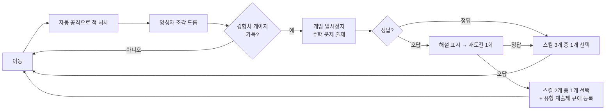

---
title: 게임 코어 기획
status: stable
owner: 기획
updated: 2026-08-20
related: [MathStack기획서, 11-코어루프, 34-성능예산]
---

# 02. 게임 코어 기획

> 한 줄 요약 — 이동, 토러스 월드, 자동 전투, 경험치, 레벨업 보상 흐름의 정본을 둔다.

---

## 3. 코어 게임 루프

**루프 1회 목표 시간** — 전투 25~45초 + 문제 10~20초. 즉 **문제는 40초에 한 번꼴**로 등장하며, 10분 세션에서 약 **16~20문항**을 푼다.

### 3.1 이동 월드 — 토러스 맵

맵은 작은 사각 경기장이 아니다. 플레이어가 한 방향으로 계속 이동하면 지구 표면을 걷는 것처럼 **반대쪽 경계로 자연스럽게 이어지는 토러스 월드**다.

- 플레이어는 경계에 막히지 않는다. 오른쪽 끝을 지나면 왼쪽 쪽 좌표로 이어지고, 위/아래도 동일하다.
- 투사체도 같은 월드 규칙을 따른다. 발사 위치와 무관하게 **무기 사거리만큼 이동**하고, 맵 경계 때문에 코앞에서 사라지지 않는다.
- 적 탐색·충돌·렌더링은 경계 반대편을 “가장 가까운 쪽”으로 계산한다. 화면 가장자리에서 적이나 투사체가 튀거나 멀리 돌아가면 실패다.
- 월드 크기는 뷰포트보다 충분히 커야 한다. 카메라가 이동하며 넓은 필드를 탐험하는 느낌을 주되, 끝에 닿아도 벽을 보여주지 않는다.

### 3.2 설계 원칙

1. **교육이 먼저다.** 문제가 학년 성취기준에 실제로 대응하지 않으면 이 프로젝트는 실패다.
2. **흐름을 끊지 않는다.** 문제는 전투 리듬의 일부다. 1문항 10~20초를 넘기면 게임이 학습지가 된다.
3. **오답은 처벌이 아니라 학습이다.** 체력을 깎지 않는다. 해설을 보여주고, 같은 유형을 나중에 다시 낸다.
4. **수학을 빼도 재밌어야 한다.** 문제 시스템을 끈 상태로 플레이해도 게임으로 성립하는지가 프로토타입 합격 기준이다.

### 3.3 레벨업 보상 흐름

경험치가 가득 차면 게임이 멈추고 퀴즈가 뜬다. 퀴즈는 보상을 얻기 위한 관문이며, 정답 판정 뒤 반드시 스킬 선택으로 이어진다.

| 결과 | 다음 흐름 | 선택지 |
| --- | --- | --- |
| 1차 정답 | 스킬 선택 창 | 3개 |
| 1차 오답 | 해설 표시 후 재도전 | — |
| 재도전 정답 | 스킬 선택 창 | 3개 |
| 재도전 오답 | 해설 표시 + 오개념 큐 등록 후 스킬 선택 창 | 2개 |

스킬 선택 창은 무기·패시브·각성 후보를 보여준다. 각성 조건을 만족한 무기가 있으면 다음 보상 선택지에 각성을 우선 노출한다. 선택이 적용되기 전에는 전투를 재개하지 않는다.

## 10. 드롭 & 픽업

경험치는 **양성자 조각**이다. 모아서 무거워지는 것이 곧 성장이라는 세계관(§1.3)과 일치한다.

| 픽업 | 출처 | 효과 |
| --- | --- | --- |
| **양성자 조각** (파랑/초록/빨강) | 일반 적 100% | 경험치 1 / 5 / 20 |
| **아이오딘 방울** | 아이오딘 방울 처치, 상자 5% | HP +50 |
| **자기장** | 이리듐 유성 50% | 화면 내 모든 조각 즉시 획득 |
| **운석 충돌** | 이리듐 유성 50% | 화면 내 모든 적에게 200 피해 |
| **원소 캡슐** | 보스 100% | 무기/보조 1개 즉시 레벨업 |

> 이리듐이 자기장과 운석 충돌을 둘 다 드롭하는 것은 우연이 아니다 — 이리듐은 운석에 유독 많이 들어 있는 원소이며, 6,600만 년 전 공룡 멸종을 밝혀낸 단서였다. 도감에 한 줄로 넣을 만한 이야기다.

---

---

## 11. 성장 곡선

10분 안에 **18레벨**(=문제 18개) 도달을 목표로 설계한다.

| 레벨 구간 | 레벨당 필요 경험치 | 누적 | 예상 도달 시각 |
| --- | --- | --- | --- |
| 1 → 5 | 5, 8, 12, 17 | 42 | 0:30 ~ 2:00 |
| 6 → 10 | 23, 30, 38, 47, 57 | 237 | 2:00 ~ 4:30 |
| 11 → 15 | 68, 80, 93, 107, 122 | 707 | 4:30 ~ 7:30 |
| 16 → 20 | 138, 155, 173, 192, 212 | 1,577 | 7:30 ~ 10:00 |

공식: `필요경험치(n) = 5 + 1.5 × n × (n + 1) / 2` 를 정수 반올림.

> **근거** — 초반 30초 내 첫 레벨업으로 문제 출제 루프를 즉시 학습시킨다. 중반은 40초 간격을 유지하고, 후반은 적 밀도 상승으로 획득량이 늘어 간격이 유지된다.

