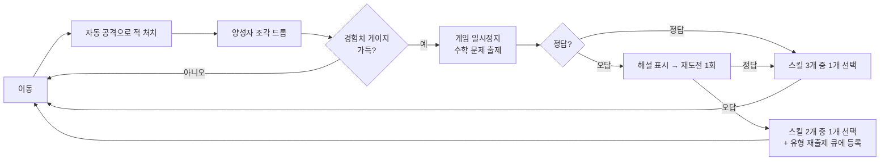

# MathStack 기획서

> **한 줄 컨셉** — 움직이기만 하면 자동으로 싸우는 10분짜리 뱀서라이크. 레벨업할 때마다 **내 학년 교과서에서 나온 진짜 수학 문제**를 풀어 다음 힘을 고른다.

---

## 목차

1. [개요](#1-개요)
2. [레퍼런스 분석](#2-레퍼런스-분석)
3. [코어 게임 루프](#3-코어-게임-루프)
4. [세션 구조 — 10분 타임라인](#4-세션-구조--10분-타임라인)
5. [캐릭터 & 아트 디렉션](#5-캐릭터--아트-디렉션)
6. [무기(액티브 스킬) 시스템](#6-무기액티브-스킬-시스템)
7. [보조(패시브) 아이템](#7-보조패시브-아이템)
8. [각성(진화) 시스템](#8-각성진화-시스템)
9. [적 에이전트](#9-적-에이전트)
10. [드롭 & 픽업](#10-드롭--픽업)
11. [성장 곡선](#11-성장-곡선)
12. [수학 문제 시스템 ★핵심](#12-수학-문제-시스템-핵심)
13. [학년별 커리큘럼 매핑](#13-학년별-커리큘럼-매핑)
14. [UI / UX](#14-ui--ux)
15. [기술 구조 요약](#15-기술-구조-요약)
16. [개발 로드맵](#16-개발-로드맵)
17. [성공 지표](#17-성공-지표)
18. [미결정 사항](#18-미결정-사항)

---

## 1. 개요

| 항목 | 내용 |
| --- | --- |
| 제목 | **MathStack** (매스스택) |
| 장르 | 뱀서라이크(Bullet-heaven) 액션 + 커리큘럼 기반 수학 퀴즈 |
| 플랫폼 | 웹 브라우저 (PC 우선, 태블릿 터치 대응) |
| 대상 | 초등학교 **3~6학년** |
| 1회 플레이 | **10분** |
| 조작 | **이동만.** 공격은 전부 자동 (WASD / 방향키 / 드래그) |
| 세계관 | **주기율표 왕국** — 안정한 원소가 붕괴하는 원소에 맞선다 (§1.3) |
| 개발 | Windows · **TypeScript** 단일 언어 (빌드 타임 + 런타임) |
| 배포 | **Netlify 등 정적 호스팅.** 런타임 서버 없음 (§15) |

### 1.1 왜 이 게임인가

수학 학습 게임은 대개 둘 중 하나로 실패한다. **게임이 재미없거나**(문제 풀이에 껍데기만 씌운 것), **수학이 가짜이거나**(학년 무관한 단순 연산 반복). MathStack은 두 축을 각각 제대로 만든다.

- **게임 축** — Vampire Survivors의 검증된 루프(자동 전투 · 무수한 적 · 빌드 조합)를 10분 규모로 압축한다. 수학을 빼도 게임으로 성립해야 한다.
- **수학 축** — 2022 개정 교육과정 성취기준에 **코드 단위로 대응**하는 문항을 낸다. 학년·학기·영역이 실제로 맞아야 한다.

### 1.2 핵심 차별점

레퍼런스인 `수학 서바이버` 대비 개선점이 이 프로젝트의 존재 이유다.

| # | 수학 서바이버의 한계 | MathStack의 해결 |
| --- | --- | --- |
| 1 | 학년별 문제가 단순 연산에 편중 | **4개 영역 균형 출제** (수와 연산 / 변화와 관계 / 도형과 측정 / 자료와 가능성) |
| 2 | 학년 구분이 형식적 | 성취기준 **코드 단위 매핑**, 학년+**학기** 필터 |
| 3 | 난이도가 평탄 | 게임 레벨과 연동된 **5단계 난이도**, 후반에 문장제·추론 등장 |
| 4 | 오답 선택지가 무작위 | **오개념 기반 오답 설계** — 선택지마다 어떤 실수인지 근거를 기록 |
| 5 | 오답 피드백 없음 | 오답 즉시 **해설 노출 + 재도전 1회**, 해당 유형을 후반에 재출제 |
| 6 | 문항 수가 유한해 반복됨 | **템플릿 기반 파라미터 생성**으로 사실상 무한 |
| 7 | 아이템·몬스터 이름이 범용적 | **원소 × 원자번호 명명 체계**(§6.1) — 이름 자체가 교육 자산 |

### 1.3 세계관 — 주기율표 왕국

> **118번 원소 오가네손이 깨어났다.**
>
> 오가네손은 주기율표의 마지막 칸에 있는, 존재한 지 1초도 못 버티는 원소다. 그것이 붕괴하면서 왕국의 **수(數)의 질서**가 무너지기 시작했다. 안정하던 원소들이 번호를 잃고, 불안정한 방사성 원소들이 깨어나 몰려온다.
>
> 너는 1번 원소 **수소**. 가장 가볍고 가장 처음인 원소다.
> **수의 성질을 되찾을 때마다 원소 하나가 다시 안정을 얻는다.**
> 10분 안에 오가네손에 닿아라.

이 설정이 게임 시스템에 그대로 대응한다.

| 서사 | 시스템 |
| --- | --- |
| 수의 질서가 무너졌다 | 수학 문제가 출제되는 이유 |
| 수의 성질을 되찾는다 | 레벨업 → 문제 정답 → 스킬 획득 |
| 안정한 원소 vs 불안정한 원소 | 플레이어·무기(§6) vs 적(§9) |
| 양성자를 모아 무거워진다 | 경험치 획득 → 레벨업 |
| 원소가 변한다 | 각성 — 탄소→다이아몬드, 산소→오존(§8) |
| 주기율표의 마지막 칸 | 10분 최종보스 오가네손 |

**"왜 싸우다가 갑자기 수학 문제를 푸나"에 대한 답이 세계관 안에 있다.** 레퍼런스에는 이 연결이 없다.

---

## 2. 레퍼런스 분석

### 2.1 Vampire Survivors

핵심 메커니즘 조사 결과:

| 요소 | 내용 |
| --- | --- |
| 조작 | 이동 전용. 공격은 100% 자동 |
| 레벨업 | 경험치 보석 획득 → 레벨업 시 **랜덤 아이템 선택지** 제시 |
| 무기 | 무기별 독립 레벨업, 최대 강화 후 조건 충족 시 **진화** |
| 진화 조건 | 무기 최대 레벨 + **짝꿍 패시브 보유** + 보스 상자 획득 |
| 패시브 | 자석(획득 범위), 회복, 행운(드롭률), 공격력, 이동속도 등 |
| 스폰 | 시간대별 웨이브. 시간이 갈수록 밀도·체력·속도 상승 |
| 세션 | 30분. 종료 시점에 사신(Reaper) 등장 |
| 메타 | 골드로 영구 능력치 구매 → 판 사이에 성장 유지 |

**MathStack이 취하는 것** — 자동 전투, 레벨업 선택지, 무기+패시브 진화, 시간대별 웨이브, 픽업(자석·회복·폭탄).
**버리는 것** — 30분 길이(→10분), 복잡한 진화 차트(→1:1 짝꿍 고정), 골드 상점 메타 프로그레션(v1 제외).

### 2.2 수학 서바이버

| 요소 | 내용 |
| --- | --- |
| 컨셉 | "수달 용사여, 문제를 풀어 힘을 되찾고 10분을 버텨라" |
| 세션 | **10분** |
| 학년 | 3~6학년 선택 |
| 조작 | 이동만, 공격 자동 (드래그 / 방향키 / WASD) |
| 출제 | 레벨업 시 문제 출제. **틀려도 재도전 가능**, 정답률만 기록 |
| 구조 | 3분·6분 중간보스 → 8~9분 "초월 수련"(문제 3개) → 10분 최종보스 |
| 진화 | 무기 Lv.5 + 짝꿍 보조 아이템 → **각성** |
| 픽업 | 별 몬스터 = 맵 전체 자석/폭탄, 생선 고양이 = 체력 +50 |
| 부가 | 용사 이름 입력, 학급 코드로 반별 랭킹 |
| HUD | 생존 시간 · 레벨 · 처치 수 · 정답률 · 액티브/패시브 슬롯 |

**MathStack이 취하는 것** — 10분 세션, 3/6분 중간보스와 8~9분 집중 문제 구간, 무기 Lv.5+짝꿍 각성, 처벌 없는 재도전.
**v1에서 보류하는 것** — 학급 코드 랭킹. 정적 배포에서는 서버가 없어 구현할 수 없다(§15.6). v1은 개인 기록만 남긴다.
**개선하는 것** — §1.2의 6개 항목 전부. 특히 문항 품질.
**차별화하는 것** — 아이템 명명 체계. 레퍼런스의 아이템은 "자석·계산기·공책"처럼 어느 학습 게임에나 있는 이름이다. MathStack은 **화학 원소의 원자번호를 수학적 근거로 삼는 명명 규칙**(§6.1)을 쓴다. 이름 자체가 교육 자산이 되고, 세계관이 레퍼런스와 겹치지 않는다.

> **설계 판단:** 10분 세션을 그대로 채택한다. 초등학생 집중 지속 시간과 쉬는 시간(10분) 길이에 맞고, 학교에서 1교시 중 여러 판을 돌릴 수 있다.

---

## 3. 코어 게임 루프



**루프 1회 목표 시간** — 전투 25~45초 + 문제 10~20초. 즉 **문제는 40초에 한 번꼴**로 등장하며, 10분 세션에서 약 **16~20문항**을 푼다.

### 3.1 설계 원칙

1. **교육이 먼저다.** 문제가 학년 성취기준에 실제로 대응하지 않으면 이 프로젝트는 실패다.
2. **흐름을 끊지 않는다.** 문제는 전투 리듬의 일부다. 1문항 10~20초를 넘기면 게임이 학습지가 된다.
3. **오답은 처벌이 아니라 학습이다.** 체력을 깎지 않는다. 해설을 보여주고, 같은 유형을 나중에 다시 낸다.
4. **수학을 빼도 재밌어야 한다.** 문제 시스템을 끈 상태로 플레이해도 게임으로 성립하는지가 프로토타입 합격 기준이다.

---

## 4. 세션 구조 — 10분 타임라인

| 시각 | 이벤트 | 적 밀도 | 의도 |
| --- | --- | --- | --- |
| 0:00~1:00 | 튜토리얼 웨이브 — 라돈 유령만 소수 | 낮음 | 조작 학습. 첫 레벨업을 30초 안에 |
| 1:00~2:30 | 소듐 돌격체 합류 | 보통 | 회피 조작 학습 |
| 2:30~3:00 | 밀집 웨이브 | 높음 | 광역 무기의 가치 체감 |
| **3:00** | **중간보스 1 — 테크네튬 복제자** (Tc, 43) | — | 첫 단일 표적. 상자 드롭 |
| 3:00~5:30 | 납 방벽 · 우라늄 분열체 혼합 | 보통↑ | 빌드 분기 시작 |
| **6:00** | **중간보스 2 — 폴로늄 분할자** (Po, 84) | — | 원거리 대응 요구. 상자 드롭 |
| 6:00~8:00 | 전 종류 혼합, 밀도 급상승 | 매우 높음 | 각성 무기 없으면 버거운 구간 |
| **8:00~9:00** | **초월 수련** — 전투 중단, 문제 3연속 | — | 세션 최고 난이도 문항. 대형 보상 |
| 9:00~10:00 | **최종보스 — 오가네손 · 붕괴의 왕** (Og, 118) + 잡몹 | 최대 | 클라이맥스 |
| 10:00 | 결과 화면 | — | 정답률·처치 수·생존 기록 |

**패배 조건** — 체력 0. 즉시 결과 화면으로 이동하되, 기록은 남긴다.
**승리 조건** — 10분 생존 + 오가네손 처치.

> **보스 원자번호가 43 → 84 → 118로 오른다.** 주기율표를 거슬러 올라가 마지막 칸에 닿는 구조이며, 세계관(§1.3)의 "오가네손에 닿아라"가 진행도 그 자체가 된다.

> **초월 수련 (8:00~9:00)** — 수학 서바이버의 동명 구간을 계승한다. 전투를 완전히 멈추고 해당 학년 **난이도 4~5** 문항 3개를 연속 출제한다. 3문제 전부 정답 시 각성 무기를 1개 즉시 부여한다. 게임에서 수학이 가장 크게 보상받는 순간이며, 문제를 성실히 풀 동기를 만든다.

---

## 5. 캐릭터 & 아트 디렉션

### 5.1 기본 규격

모든 캐릭터는 **원 + 눈**이다. 팔·다리·입은 그리지 않는다. 코드로 그릴 수 있어야 하며, 스프라이트 이미지 의존을 최소화한다.

```
        ● ●        ← 눈 2개 (흰 원 + 검은 동공)
     (       )     ← 몸통: 단색 원 + 2px 외곽선
        \___/      ← 그림자: 아래쪽 타원 (투명도 20%)
```

| 파라미터 | 값 |
| --- | --- |
| 몸통 | 정원, 반지름 10~28px (개체별) |
| 외곽선 | 2px, 몸통색을 20% 어둡게 |
| 눈 | 흰 원 r=몸통r×0.25, 동공 r=흰자×0.5 |
| 시선 | 동공이 **이동 방향으로 오프셋** (최대 흰자 반지름의 40%) |
| 그림자 | 타원, 몸통 아래 y+r×0.8, 투명도 20% |
| 피격 | 3프레임 흰색 플래시 + 반대 방향 넉백 |
| 사망 | 0.2초 확대 후 축소 소멸 + 파티클 6개 |

**차별화 수단은 4가지뿐이다** — 색, 크기, 눈 모양(동공 크기/개수), 부착 장식(뿔·왕관·모자 등 단순 도형 1개). 이 제약이 아트 비용을 0에 가깝게 만든다.

### 5.2 플레이어 캐릭터 (4종)

| 캐릭터 | 원자번호 | 색 | 시작 무기 | 특성 |
| --- | --- | --- | --- | --- |
| **수소 동글이** (H) | 1 | `#4CAF50` 초록 | 수소 화살 | 균형형. 최대 체력 +10% |
| **네온 동글이** (Ne) | 10 | `#2196F3` 파랑 | 네온 광선 | 이동속도 +15%, 체력 −10% |
| **탄소 동글이** (C) | 6 | `#FF9800` 주황 | 탄소 고리 | 투사체 수 +1, 공격력 −10% |
| **산소 동글이** (O) | 8 | `#9C27B0` 보라 | 산소 파동 | 공격 범위 +20%, 쿨타임 +10% |

캐릭터는 **시작 무기의 원소를 그대로 쓴다.** 1·6·8·10은 초등학생에게 가장 익숙한 네 원소이며, 각각 항등원·완전수·세제곱수·십진법이라는 수학적 성격을 갖는다(§6.1).

플레이어는 눈이 **크고 동공이 또렷하며**, 적은 눈이 작거나 흐리다. 한눈에 아군/적을 구분하기 위한 규칙이다.

### 5.3 팔레트

| 용도 | 색 |
| --- | --- |
| 배경 (필드) | `#1A1A2E` |
| 배경 격자 | `#252540` — **주기율표 칸** 모양으로 그린다 |
| 플레이어 | 캐릭터별 (위 표) |
| 일반 적 | `#E8574A` 계열 |
| 엘리트 적 | `#FFD700` 테두리 추가 |
| 보스 | `#8B0000` + 왕관 장식 |
| 양성자 조각 | `#00E5FF` |
| 회복 | `#76FF03` |
| UI 강조 | `#FFC107` |

**적에게는 방사성 표식을 붙인다.** §5.1의 "부착 장식 1개" 자리에 삼엽 방사선 마크나 붕괴 잔상을 넣으면, 안정한 플레이어와 불안정한 적이 색 외에도 구분된다. 캐릭터 위에는 **원소 기호 1~2글자**를 작게 띄운다 — `H`, `Rn`, `Og`. 원+눈 규격을 깨지 않으면서 이름을 읽게 하는 가장 싼 방법이다.

---

## 6. 무기(액티브 스킬) 시스템

- 슬롯 **6개**. 무기별 독립 레벨 **1~5**.
- 전부 자동 발동. 플레이어는 이동만 한다.
- 아래 수치는 **Lv.1 기준**이며 정본은 [13-스킬-무기명세.md](10-게임디자인/13-스킬-무기명세.md)에서 관리한다.

### 6.1 명명 규칙 — 원소 × 수학 ★

무기·보조·각성의 이름은 **화학 원소**에서 가져온다. 단, 아무 원소나 쓰지 않는다.

> **원자번호가 그 아이템의 수학적 성격과 일치하는 원소만 고른다.**

이것이 규칙의 전부이며, 이름이 단순한 분위기 차용이 아니라 **교육 자산**이 되는 이유다. 아이는 무기를 고르면서 완전수와 제곱수를 자연스럽게 본다. 도감 화면에서 "탄소는 6번, 6은 1+2+3이라서 완전수야"를 한 줄로 보여줄 수 있다.

새 무기를 추가할 때도 이 규칙을 지킨다 — 원자번호에서 수학적 근거를 못 찾으면 **그 원소를 쓰지 않는다.**

### 6.2 무기 목록

| ID | 이름 | 원자번호 | 수학적 근거 | 형태 | 데미지 | 쿨타임 |
| --- | --- | --- | --- | --- | --- | --- |
| `hydrogen_arrow` | **수소 화살** (H) | 1 | 곱셈의 항등원 — 가장 기본 | 전방 투사체 | 10 | 1.2s |
| `neon_beam` | **네온 광선** (Ne) | 10 | 십진법의 밑 | 직선 관통 | 14 | 2.0s |
| `carbon_ring` | **탄소 고리** (C) | 6 | **완전수** (1+2+3=6), 육각 결정 | 궤도 회전 | 8/틱 | 상시 |
| `oxygen_wave` | **산소 파동** (O) | 8 | 2³ 세제곱수, 기호 O가 원 | 원형 확산 | 12 | 2.5s |
| `iron_barrier` | **철 결계** (Fe) | 26 | 가장 안정한 원자핵 — 방어의 상징 | 근접 지속 | 6/틱 | 상시 |
| `magnesium_bomb` | **마그네슘 폭탄** (Mg) | 12 | **고도합성수** — 약수 6개(1·2·3·4·6·12), 잘 나뉘는 수 | 착탄 분열 | 18 | 3.0s |
| `gold_spiral` | **황금 나선** (Au) | 79 | **황금비 φ** — 금이 곧 황금비 | 왕복 | 11 | 2.2s |
| `boron_shot` | **붕소 산탄** (B) | 5 | 원자번호가 곧 **발사 수 5발** | 다탄 확산 | 5×5 | 1.8s |

**레벨업 효과** — Lv당 데미지 +20%, 3레벨에서 투사체/범위 +1단계, 5레벨에서 각성 자격 획득.

> **붕소 산탄**은 원자번호 5가 그대로 투사체 5발이다. 수치와 이름이 일치하는 유일한 무기이며, 이 규칙을 아이에게 설명하는 데 가장 좋은 예시다.

---

## 7. 보조(패시브) 아이템

슬롯 **6개**, 레벨 **1~3**. 무기와 같은 명명 규칙(§6.1)을 따른다.

| ID | 이름 | 원자번호 | 수학적 근거 | 효과 (Lv당) | 짝꿍 무기 |
| --- | --- | --- | --- | --- | --- |
| `neodymium` | **네오디뮴 자석** (Nd) | 60 | 60진법(시간·각도), 약수 12개 | 획득 범위 +25% | `oxygen_wave` |
| `silicon` | **규소 연산칩** (Si) | 14 | 반도체 = 계산 그 자체 | 공격력 +12% | `hydrogen_arrow` |
| `helium` | **헬륨 부츠** (He) | 2 | **최소 소수**, 가장 가벼운 기체 | 이동속도 +10% | `gold_spiral` |
| `chlorine` | **염소 정화액** (Cl) | 17 | 소수, 표백 = 지우는 성질 | 쿨타임 −8% | `neon_beam` |
| `krypton` | **크립톤 렌즈** (Kr) | 36 | **6² 제곱수** — 넓이의 수 | 공격 범위 +15% | `iron_barrier` |
| `calcium` | **칼슘 결정** (Ca) | 20 | 뼈와 성장의 원소 | 최대 체력 +20, 회복 +0.3 | `magnesium_bomb` |
| `nickel` | **니켈 코일** (Ni) | 28 | **완전수** (1+2+4+7+14=28) | 투사체 수 +1 (Lv2·Lv3만) | `carbon_ring` |
| `silver` | **은빛 행운석** (Ag) | 47 | 소수, 예로부터 행운의 금속 | 행운 +15% | `boron_shot` |

> **탄소(6)와 니켈(28)이 짝꿍인 것은 우연이 아니다.** 둘 다 **완전수**이며, 실제로 니켈은 탄소 나노구조를 합성하는 촉매다. 이 조합의 각성이 「다이아몬드 궤도」인 이유이기도 하다.

---

## 8. 각성(진화) 시스템

Vampire Survivors의 진화를 단순화한다. **1:1 고정 짝꿍**이라 초등학생도 규칙을 즉시 이해한다.

**조건** — `무기 Lv.5` + `짝꿍 패시브 Lv.3` 보유 → **다음 레벨업 선택지에 각성 무기가 확정 등장**.

> Vampire Survivors는 보스 상자를 열어야 진화하지만, 우리는 레벨업 선택지로 처리한다. 10분 안에 각성까지 도달하려면 상자 운에 맡길 여유가 없다.

**각성명은 그 원소가 실제로 변하는 상위 형태를 쓴다.** 탄소가 다이아몬드가 되고, 산소가 오존이 되는 변화는 초등학생도 아는 것이라 각성의 "강해졌다"는 감각을 이름만으로 전달한다.

| 기본 무기 | + 보조 | → 각성 무기 | 변화의 근거 | 각성 효과 |
| --- | --- | --- | --- | --- |
| 수소 화살 | 규소 연산칩 | **중수소 폭풍** | 수소의 무거운 동위원소 | 8방향 동시 발사, 관통 |
| 네온 광선 | 염소 정화액 | **네온 무한광선** | 꺼지지 않는 네온사인 | 화면 가로지르는 상시 빔 |
| 탄소 고리 | 니켈 코일 | **다이아몬드 궤도** | 탄소 → 다이아몬드 | 회전체 6개, 접촉 시 분열 |
| 산소 파동 | 네오디뮴 자석 | **오존 충격파** | O₂ → O₃, 산소 3개 | 적을 끌어당긴 뒤 폭발 |
| 철 결계 | 크립톤 렌즈 | **강철 항등막** | 철 + 탄소 → 강철 | 전방위 방어막 + 반사 |
| 마그네슘 폭탄 | 칼슘 결정 | **마그네슘 연쇄섬광** | 마그네슘 연소의 백색광 | 4분열, 분열체도 폭발 |
| 황금 나선 | 헬륨 부츠 | **황금비 순환** | 금 → 황금비 φ | 부메랑 3개 전방위 순환 |
| 붕소 산탄 | 은빛 행운석 | **붕소 무한탄막** | 5발 → 12발 확산 | 12발 확산, 랜덤 치명타 |

> **회전체 6개**(다이아몬드 궤도)와 **산소 3개**(오존)처럼, 각성 수치도 가능하면 이름의 숫자와 맞춘다. 「오존 충격파」가 3단 파동이면 이름이 곧 설명이 된다.

---

## 9. 적 에이전트

> **용어** — 이 문서에서 "에이전트"는 게임 내 적 개체를 뜻한다. 상세 명세는 [12-에이전트-적명세.md](10-게임디자인/12-에이전트-적명세.md).

### 9.1 명명 규칙 — 불안정한 원소

플레이어와 무기가 **안정한 원소**라면, 적은 그 반대다.

> **적은 방사성·불안정·유해 원소에서 이름을 가져온다.** 원자번호의 수학적 근거는 무기와 같은 규칙(§6.1)을 따른다.

이 대비가 세계관(§1.3)을 시각적으로 성립시킨다. 아이가 "라돈은 왜 유령처럼 스며들까"를 궁금해하면 그게 이 명명의 목적이다.

### 9.2 일반 적

| ID | 이름 | 번호 | 근거 | 등장 | HP | 속도 | 접촉 | 행동 |
| --- | --- | --- | --- | --- | --- | --- | --- | --- |
| `radon` | **라돈 유령** (Rn) | 86 | 무색무취 방사성 기체 — 스며든다 | 0:00~ | 20 | 40 | 4 | 직선 추격 |
| `sodium` | **소듐 돌격체** (Na) | 11 | **회문수**이자 소수. 물과 만나면 튀어오른다 | 1:00~ | 40 | 55 | 6 | 4초마다 0.5초 정지 후 돌진 |
| `lead` | **납 방벽** (Pb) | 82 | 안정 동위원소를 갖는 **마지막 원자번호**, 방사선 차폐재 | 3:00~ | 120 | 22 | 8 | 저속 추격, 전방 피해 50% 감소 |
| `uranium` | **우라늄 분열체** (U) | 92 | **핵분열** — 하나가 둘이 된다 | 3:30~ | 60 | 35 | 5 | 사망 시 절반 크기 2마리로 분열 (1회) |
| `caesium` | **세슘 방사체** (Cs) | 55 | **삼각수** (1+2+⋯+10), 방사선을 내뿜는다 | 4:30~ | 50 | 25 | 4 | 사거리 유지하며 방사탄 발사 |
| `iridium` | **이리듐 유성** (Ir) | 77 | **회문수**. 운석에 유독 많은 원소 | 2:00~ | 30 | 60 | 3 | 도망. 처치 시 **자석 또는 폭탄** 드롭 |
| `iodine` | **아이오딘 방울** (I) | 53 | 소수. 상처를 소독하는 원소 | 2:00~ | 25 | 45 | 0 | 무해. 처치 시 **체력 +50** |

`iridium`과 `iodine`은 플레이어가 **"쫓아갈 이유"를 만드는 보상 몬스터**다. 이리듐이 운석 원소라 유성처럼 떨어지고, 아이오딘이 소독약이라 체력을 회복시키는 것은 둘 다 실제 과학이다.

### 9.3 보스 — 극도로 불안정한 원소

| 시각 | 이름 | 번호 | 근거 | HP | 패턴 |
| --- | --- | --- | --- | --- | --- |
| 3:00 | **테크네튬 복제자** (Tc) | 43 | 소수. **최초의 인공 원소** — 만들어진 존재라서 자기를 복제한다 | 800 | 3초마다 분신 2체 소환. 느리지만 접촉 피해 큼 |
| 6:00 | **폴로늄 분할자** (Po) | 84 | **고도합성수** — 약수 12개, 잘 나뉘는 수 | 1,800 | 원형 탄막을 4방향으로 분할 발사. 순간이동 |
| 9:00 | **오가네손 · 붕괴의 왕** (Og) | 118 | **주기율표의 마지막 칸.** 반감기 1초 미만 | 6,000 | 3페이즈. 잡몹 소환 → 광역 장판 → 추격 돌진 |

> **오가네손이 최종보스인 것은 서사와 수가 맞물린 결과다.** 118은 인류가 만든 마지막 번호이고, 그 원소는 1초도 존재하지 못한다. "끝에 있으면서 가장 불안정한 것"이라는 설정이 곧 사실이다.

보스 처치 시 **원소 캡슐**을 드롭하며, 캡슐은 무기/보조 1개를 즉시 레벨업시킨다(문제 출제 없음).

### 9.4 스폰 규칙

- 화면 밖 **가장자리 링**에서 스폰. 플레이어로부터 최소 400px.
- 동시 존재 상한 **300체** (§15 성능 예산). 상한 도달 시 가장 먼 개체부터 소멸.
- 시간당 계수: `밀도 = 기본 × (1 + 경과분 × 0.35)`, `HP = 기본 × (1 + 경과분 × 0.18)`.

---

## 10. 드롭 & 픽업

경험치는 **양성자 조각**이다. 모아서 무거워지는 것이 곧 성장이라는 세계관(§1.3)과 일치한다.

| 픽업 | 출처 | 효과 |
| --- | --- | --- |
| **양성자 조각** (파랑/초록/빨강) | 일반 적 100% | 경험치 1 / 5 / 20 |
| **아이오딘 방울** | 아이오딘 방울 처치, 상자 5% | HP +50 |
| **자기장** | 이리듐 유성 50% | 화면 내 모든 조각 즉시 획득 |
| **운석 충돌** | 이리듐 유성 50% | 화면 내 모든 적에게 200 피해 |
| **원소 캡슐** | 보스 100% | 무기/보조 1개 즉시 레벨업 |

> 이리듐이 자기장과 운석 충돌을 둘 다 드롭하는 것은 우연이 아니다 — 이리듐은 운석에 유독 많이 들어 있는 원소이며, 6,600만 년 전 공룡 멸종을 밝혀낸 단서였다. 도감에 한 줄로 넣을 만한 이야기다.

---

## 11. 성장 곡선

10분 안에 **18레벨**(=문제 18개) 도달을 목표로 설계한다.

| 레벨 구간 | 레벨당 필요 경험치 | 누적 | 예상 도달 시각 |
| --- | --- | --- | --- |
| 1 → 5 | 5, 8, 12, 17 | 42 | 0:30 ~ 2:00 |
| 6 → 10 | 23, 30, 38, 47, 57 | 237 | 2:00 ~ 4:30 |
| 11 → 15 | 68, 80, 93, 107, 122 | 707 | 4:30 ~ 7:30 |
| 16 → 20 | 138, 155, 173, 192, 212 | 1,577 | 7:30 ~ 10:00 |

공식: `필요경험치(n) = 5 + 1.5 × n × (n + 1) / 2` 를 정수 반올림.

> **근거** — 초반 30초 내 첫 레벨업으로 문제 출제 루프를 즉시 학습시킨다. 중반은 40초 간격을 유지하고, 후반은 적 밀도 상승으로 획득량이 늘어 간격이 유지된다.

---

## 12. 수학 문제 시스템 ★핵심

### 12.1 문항 데이터 구조

```jsonc
{
  "id": "G4-N-016-03",             // <학년>-<영역>-<성취기준일련>-<변형>
  "grade": 4,                       // 3 | 4 | 5 | 6
  "semester": 2,                    // 1 | 2
  "domain": "수와 연산",            // 수와 연산 | 변화와 관계 | 도형과 측정 | 자료와 가능성
  "unit": "소수의 덧셈과 뺄셈",
  "standard": "4수01-16",           // 2022 개정 성취기준 코드
  "difficulty": 2,                  // 1(기초) ~ 5(심화)
  "format": "choice",               // choice | number_input
  "stem": "3.42 + 1.8 은 얼마인가요?",
  "choices": ["5.22", "3.60", "5.20", "4.22"],
  "answer": "5.22",
  "distractorReason": [
    "정답",
    "소수점 자리를 맞추지 않고 끝자리를 정렬해 더함",
    "받아올림 누락",
    "소수 첫째 자리만 더함"
  ],
  "explanation": "소수점의 위치를 맞춰 세로로 쓰고 더합니다. 3.42 + 1.80 = 5.22",
  "timeLimitSec": 15,
  "misconceptionTag": "decimal_alignment"
}
```

### 12.2 오답 선택지 설계 규칙 ★

**이 프로젝트에서 가장 중요한 규칙이다.** 레퍼런스 게임이 실패한 지점이다.

1. 오답은 **실제 학생이 저지르는 오개념**에서 유도한다. 무작위 숫자·정답±1 금지.
2. `distractorReason`에 각 선택지가 어떤 실수인지 반드시 기록한다. 비어 있으면 문항 승인 불가.
3. 한 문항의 오답 3개는 **서로 다른 오개념**이어야 한다.
4. `misconceptionTag`가 같은 오답을 2회 이상 고르면, 해당 태그의 문항을 후반에 우선 재출제한다.

**오개념 태그 예시**

| 태그 | 학년 | 전형적 실수 |
| --- | --- | --- |
| `decimal_alignment` | 4 | 소수점을 맞추지 않고 끝자리 정렬 |
| `fraction_denominator_add` | 4 | 분모끼리도 더함 (1/4+2/4=3/8) |
| `borrow_omission` | 3 | 받아내림 누락 |
| `remainder_ignore` | 3 | 나머지를 버리거나 몫에 붙임 |
| `lcm_gcd_swap` | 5 | 최대공약수와 최소공배수 혼동 |
| `area_perimeter_swap` | 5 | 넓이와 둘레 공식 혼동 |
| `ratio_inverse` | 6 | 비의 전항·후항을 뒤집음 |
| `circle_radius_diameter` | 6 | 반지름과 지름 혼동 |

### 12.3 난이도 5단계

| 난이도 | 성격 | 예시 (4학년, `4수01-15` 분수의 덧셈) |
| --- | --- | --- |
| 1 | 단순 계산, 작은 수 | `1/5 + 2/5 = ?` |
| 2 | 계산 + 받아올림/자리수 확대 | `3/7 + 5/7 = ?` (가분수 결과) |
| 3 | 개념 이해·판별 | `아래 중 계산이 잘못된 것은?` |
| 4 | 한 문장 문장제 | `우유를 2/6L 마시고 1/6L를 더 마셨다면?` |
| 5 | 역산·다단계 추론 | `□ + 2/9 = 7/9 일 때 □는?` |

### 12.4 레벨 ↔ 난이도 매핑

| 게임 레벨 | 난이도 분포 |
| --- | --- |
| 1 ~ 3 | 난이도 1 (100%) |
| 4 ~ 7 | 난이도 1 (40%) / 2 (60%) |
| 8 ~ 11 | 난이도 2 (50%) / 3 (50%) |
| 12 ~ 15 | 난이도 3 (50%) / 4 (50%) |
| 16 ~ | 난이도 4 (60%) / 5 (40%) |
| 초월 수련 | 난이도 4~5 고정 |

### 12.5 영역 균형 출제 ★

레퍼런스의 최대 문제는 **수와 연산 편중**이다. 한 세션 18문항의 영역 배분을 강제한다.

| 영역 | 목표 비중 | 18문항 기준 |
| --- | --- | --- |
| 수와 연산 | 45% | 8문항 |
| 도형과 측정 | 30% | 5~6문항 |
| 변화와 관계 | 15% | 3문항 |
| 자료와 가능성 | 10% | 1~2문항 |

출제기는 **가중 랜덤 + 부족 영역 보정**으로 동작한다. 특정 영역이 목표 비중보다 2문항 이상 뒤처지면 다음 출제에서 해당 영역을 강제 선택한다.

### 12.6 출제 알고리즘

```
select_question(grade, semester, level, session_state):
  1. 재출제 큐가 비어있지 않고 level >= 10 이면 → 큐에서 pop (오답 유형 복습)
  2. 아니면:
     a. 난이도 = 레벨↔난이도 분포에서 추첨 (§12.4)
     b. 영역   = 가중 랜덤, 단 부족 영역이 있으면 강제 (§12.5)
     c. 후보   = 뱅크에서 (학년, 학기≤현재, 영역, 난이도) 필터
     d. 이번 세션 출제분 제외 → 후보 없으면 난이도 ±1로 확장
  3. 템플릿 문항이면 파라미터를 즉석 생성 (§12.7)
  4. 선택지 순서 셔플 후 반환
```

> **실행 위치** — 이 알고리즘은 **브라우저에서** 돈다(§15.2). 세션 상태(출제 이력·영역 카운터·오답 큐)는 메모리에만 있고 서버로 나가지 않는다. 문제 모달이 뜨는 데 네트워크 지연이 0이다.

### 12.7 템플릿 기반 문항 생성

고정 문항만으로는 반복이 금방 드러난다. 문항의 상당수를 **파라미터화된 템플릿**으로 만든다.

**템플릿은 TypeScript로 저작하고, 빌드 타임에 전개해 정적 JSON으로 굽는다**(§15.3). 브라우저는 완성된 문항 배열만 읽으므로 런타임에 수식 평가기가 필요 없고, 잘못된 문항은 배포 전에 걸러진다.

분수·소수 계산에는 **`fraction.js`·`decimal.js`를 쓴다.** 부동소수점으로 계산하면 오답이 오개념 때문이 아니라 IEEE 754 때문에 틀린 값이 되어, §12.2의 설계 전체가 무너진다.

```ts
// 예시: 4수01-15 분모가 같은 분수의 덧셈
defineTemplate({
  standard: '4수01-15',
  difficulty: 2,
  misconceptionTag: 'fraction_denominator_add',
  stem: ({ a, b, d }) => `${a}/${d} + ${b}/${d} 는 얼마인가요?`,
  params: (rng) => genFractionPair(rng, { minDen: 5, maxDen: 12, improper: true }),
  answer: (p) => frac(p.a + p.b, p.d),
  distractors: [
    ['분모끼리도 더함',     (p) => frac(p.a + p.b, p.d * 2)],
    ['분자를 뺌',           (p) => frac(Math.abs(p.a - p.b), p.d)],
    ['분모·분자 모두 더함', (p) => frac(p.a + p.b + 1, p.d)],
  ],
});
```

템플릿 1개가 수십~수백 개의 변형을 만들어내며, **오답 생성 로직이 오개념에 고정**되어 품질이 유지된다. 도형·그래프 문항 등 템플릿화가 어려운 것은 고정 문항으로 작성한다.

**전개 규모** — 템플릿당 60변형을 굽는다. 같은 템플릿의 변형이 한 세션에 두 번 나오지 않게 하기에 충분하고, 학년별 JSON을 500KB 안에 유지한다(§15.2).

### 12.8 정답/오답 처리

| 결과 | 처리 |
| --- | --- |
| 정답 (1차) | 스킬 **3개 중 1개** 선택. 정답률 +1 |
| 오답 → 재도전 정답 | 해설 3초 노출 후 재시도. 스킬 **3개 중 1개** 선택 (동일 보상) |
| 오답 → 재도전 오답 | 정답·해설 표시. 스킬 **2개 중 1개** 선택. `misconceptionTag`를 재출제 큐에 등록 |
| 시간 초과 | 오답과 동일 처리. 단 재도전 기회는 소진되지 않음 |

**체력은 절대 깎지 않는다.** 틀렸다고 게임에서 불리해지면 아이는 문제를 읽지 않고 아무거나 찍는다. 보상 차등(3택 vs 2택)만으로 충분한 동기가 된다.

### 12.9 문항 뱅크 규모 목표

템플릿당 60변형 전개 기준이다.

| 단계 | 학년당 고정 | 학년당 템플릿 | **학년당 유효 문항** | 4학년분 합계 |
| --- | --- | --- | --- | --- |
| MVP | 40 | 10 | 약 640 | 약 2,560 |
| v1.0 | 100 | 30 | 약 1,900 | 약 7,600 |

한 세션이 18문항이므로, MVP 단계에서도 학년당 **35판을 중복 없이** 돌릴 수 있다.

---

## 13. 학년별 커리큘럼 매핑

**기준** — 2022 개정 교육과정 수학과. 성취기준 코드는 학년군 단위(`4수`=3~4학년군, `6수`=5~6학년군)로 부여되므로, 아래 표에서 교과서 통상 배열에 따라 **학년·학기로 분해**했다.

**게임 적합도** — ◎ 즉시 출제 가능 / ○ 도형 이미지 필요 / △ 제한적 출제 / ✕ 실시간 퀴즈 부적합(작도·자료 수집 등 수행 활동)

### 13.1 3학년

| 학기 | 단원 | 성취기준 | 영역 | 적합도 |
| --- | --- | --- | --- | --- |
| 1 | 덧셈과 뺄셈 | 4수01-03 | 수와 연산 | ◎ |
| 1 | 등호와 동치 관계 | 4수02-03 | 변화와 관계 | ◎ |
| 1 | 평면도형 (선분·직선·반직선, 각, 직각) | 4수03-01, 4수03-02 | 도형과 측정 | ○ |
| 1 | 나눗셈 | 4수01-05, 4수01-06 | 수와 연산 | ◎ |
| 1 | 곱셈 (두 자리 × 한 자리) | 4수01-04 | 수와 연산 | ◎ |
| 1 | 길이와 시간 | 4수03-13~16 | 도형과 측정 | ◎ |
| 1 | 분수와 소수 | 4수01-09, 4수01-12 | 수와 연산 | ◎ |
| 2 | 곱셈 (세 자리 × 한 자리, 두 자리 × 두 자리) | 4수01-04 | 수와 연산 | ◎ |
| 2 | 나눗셈 (두 자리 ÷ 한 자리) | 4수01-06 | 수와 연산 | ◎ |
| 2 | 원 | 4수03-06 / 4수03-07 | 도형과 측정 | ○ / ✕ |
| 2 | 분수 (진분수·가분수·대분수) | 4수01-10, 4수01-11 | 수와 연산 | ◎ |
| 2 | 들이와 무게 | 4수03-17~23 | 도형과 측정 | ◎ |
| 2 | 그림그래프 | 4수04-01 | 자료와 가능성 | ○ |

### 13.2 4학년

| 학기 | 단원 | 성취기준 | 영역 | 적합도 |
| --- | --- | --- | --- | --- |
| 1 | 큰 수 | 4수01-01, 4수01-02 | 수와 연산 | ◎ |
| 1 | 각도 | 4수03-24, 4수03-25 | 도형과 측정 | ○ |
| 1 | 곱셈과 나눗셈 (÷ 두 자리 수) | 4수01-07, 4수01-08 | 수와 연산 | ◎ |
| 1 | 평면도형의 이동 | 4수03-04, 4수03-05 | 도형과 측정 | ○ |
| 1 | 막대그래프 | 4수04-01 | 자료와 가능성 | ○ |
| 1 | 규칙 찾기 | 4수02-01, 4수02-02 | 변화와 관계 | ◎ |
| 2 | 분수의 덧셈과 뺄셈 | 4수01-15 | 수와 연산 | ◎ |
| 2 | 삼각형 | 4수03-08, 4수03-09 | 도형과 측정 | ○ |
| 2 | 소수의 덧셈과 뺄셈 | 4수01-13, 4수01-14, 4수01-16 | 수와 연산 | ◎ |
| 2 | 사각형 (수직·평행 포함) | 4수03-03, 4수03-10 | 도형과 측정 | ○ |
| 2 | 꺾은선그래프 | 4수04-02 | 자료와 가능성 | ○ |
| 2 | 다각형 | 4수03-11, 4수03-12 | 도형과 측정 | ○ |
| — | 등호와 동치 관계 | 4수02-03 | 변화와 관계 | ◎ |

### 13.3 5학년

| 학기 | 단원 | 성취기준 | 영역 | 적합도 |
| --- | --- | --- | --- | --- |
| 1 | 자연수의 혼합 계산 | 6수01-01 | 수와 연산 | ◎ |
| 1 | 약수와 배수 | 6수01-04, 6수01-05 | 수와 연산 | ◎ |
| 1 | 규칙과 대응 | 6수02-01 | 변화와 관계 | ◎ |
| 1 | 약분과 통분 | 6수01-06, 6수01-07 | 수와 연산 | ◎ |
| 1 | 분수의 덧셈과 뺄셈 (분모 다름) | 6수01-08 | 수와 연산 | ◎ |
| 1 | 다각형의 둘레와 넓이 | 6수03-11~14 | 도형과 측정 | ○ |
| 2 | 수의 범위와 어림하기 | 6수01-02, 6수01-03 | 수와 연산 | ◎ |
| 2 | 분수의 곱셈 | 6수01-09 | 수와 연산 | ◎ |
| 2 | 합동과 대칭 | 6수03-01, 6수03-02 | 도형과 측정 | ○ |
| 2 | 소수의 곱셈 | 6수01-13 | 수와 연산 | ◎ |
| 2 | 직육면체 | 6수03-03 / 6수03-04 | 도형과 측정 | ○ / △ |
| 2 | 평균과 가능성 | 6수04-01, 6수04-04~06 | 자료와 가능성 | ◎ |

> **요청서 표기 정정** — 요청서의 5학년 항목 "수의 범사와 최대로 약수·공배수"는 **"수의 범위와 어림하기"** + **"약수와 배수(최대공약수·최소공배수)"** 두 단원으로 해석해 반영했습니다.

### 13.4 6학년

| 학기 | 단원 | 성취기준 | 영역 | 적합도 |
| --- | --- | --- | --- | --- |
| 1 | 분수의 나눗셈 | 6수01-10, 6수01-11 | 수와 연산 | ◎ |
| 1 | 각기둥과 각뿔 | 6수03-05 / 6수03-06 | 도형과 측정 | ○ / △ |
| 1 | 소수의 나눗셈 | 6수01-14, 6수01-15 | 수와 연산 | ◎ |
| 1 | 비와 비율 | 6수02-02, 6수02-03 | 변화와 관계 | ◎ |
| 1 | 직육면체의 부피와 겉넓이 | 6수03-17~19 | 도형과 측정 | ◎ |
| 1 | 여러 가지 그래프 (띠·원그래프) | 6수04-02, 6수04-03 | 자료와 가능성 | ○ / ✕ |
| 2 | 분수와 소수의 관계 | 6수01-12 | 수와 연산 | ◎ |
| 2 | 공간과 입체 (쌓기나무) | 6수03-09, 6수03-10 | 도형과 측정 | ○ |
| 2 | 비례식과 비례배분 | 6수02-04, 6수02-05 | 변화와 관계 | ◎ |
| 2 | 원주율과 원의 넓이 | 6수03-15, 6수03-16 | 도형과 측정 | ◎ |
| 2 | 원기둥, 원뿔, 구 | 6수03-07 / 6수03-08 | 도형과 측정 | ○ / △ |

### 13.5 출제 제외 성취기준

다음은 **실시간 10~20초 퀴즈로 평가할 수 없는** 수행·작도 활동이다. 출제 대상에서 제외한다.

| 코드 | 내용 | 제외 사유 |
| --- | --- | --- |
| 4수03-07 | 컴퍼스로 원 그리기 | 실기 활동 |
| 4수04-03 | 자료 수집·정리·그래프 작성 | 장시간 프로젝트 |
| 6수03-04, 6수03-06, 6수03-08 | 전개도 그리기 | 작도 활동 (단, "올바른 전개도 고르기"는 ○로 출제 가능) |
| 6수04-03 | 탐구 문제 설정 및 자료 수집 | 장시간 프로젝트 |

> **학기 필터** — 기본값은 "현재 학기까지". 3학년 1학기 학생에게 2학기 분수 문항을 내지 않는다. 설정에서 "전 학년 범위"로 확장 가능하다.

---

## 14. UI / UX

### 14.1 화면 흐름

```
타이틀 → 학년/학기 선택 → 캐릭터 선택 → (용사 이름 입력) → 게임 → 결과
                                                          └ v2: 학급 코드 (§15.6)
```

### 14.2 인게임 HUD

```
┌────────────────────────────────────────────────────┐
│  ⏱ 04:32        Lv.11   ████████░░  237/305        │  ← 상단: 시간·레벨·경험치 바
│  ❤ 82/120                          ⚔ 342  ✓ 9/11   │  ← 체력 / 처치 수 / 정답 수
├────────────────────────────────────────────────────┤
│                                                    │
│                     [ 게임 화면 ]                   │
│                                                    │
├────────────────────────────────────────────────────┤
│  액티브  [＋5][－3][×2][ ][ ][ ]                    │  ← 무기 6슬롯 + 레벨
│  패시브  [🧲3][🔢2][👟1][ ][ ][ ]                   │  ← 패시브 6슬롯 + 레벨
└────────────────────────────────────────────────────┘
```

### 14.3 문제 모달

- 게임이 **완전히 정지**한다. 배경은 40% 어둡게 처리.
- 상단에 **남은 시간 링 게이지** (15초 기준). 5초 남으면 붉게 점멸.
- 문제 글자 크기 최소 **24px**. 4지선다는 2×2 그리드, 버튼 최소 높이 56px (터치 대응).
- 정답 시 초록 플래시 + 0.3초, 오답 시 붉은 흔들림 + 해설 카드 슬라이드 인.
- 분수는 `3/5`가 아니라 **세로 분수 형태**로 렌더한다. 초등 교과서 표기를 따른다.

### 14.4 접근성

- 색만으로 정보를 전달하지 않는다 (정답/오답에 아이콘 병기).
- 모든 텍스트 명도 대비 4.5:1 이상.
- 문제 시간 제한 해제 옵션 제공 (설정 → "천천히 풀기").
- 화면 흔들림·섬광 효과 강도 조절 옵션.

---

## 15. 기술 구조 요약

> 상세는 [31-아키텍처.md](30-기술/31-아키텍처.md), [35-배포.md](30-기술/35-배포.md), [AGENTS.md](../AGENTS.md) §6.

### 15.1 배포 제약과 그 귀결 ★

**요구사항: Netlify 같은 정적 호스팅에 배포한다.**

Netlify는 정적 파일 호스팅 + 서버리스 함수 플랫폼이며, **서버리스 함수 런타임은 JavaScript·TypeScript·Go만 지원한다.** 우리는 함수조차 쓰지 않고 **순수 정적 배포**로 간다.

두 가지 결정이 여기서 나온다.

**결정 1 — 런타임 서버를 두지 않는다.** 문항 출제와 채점을 전부 브라우저에서 한다.

**결정 2 — 언어를 TypeScript 하나로 통일한다.** 초기 설계는 빌드 타임 Python + 런타임 JS였다. 동작은 하지만 **같은 계약이 두 번 정의된다** — Pydantic 문항 모델과 JS 쪽 타입이 손으로 동기화된다. 이 프로젝트의 품질 서사가 통째로 "문항 뱅크가 정확해야 한다"인데, 그 계약에 이음매가 있는 건 구조적 약점이다.

| | 초기 설계 | **확정 설계** |
| --- | --- | --- |
| 언어 | Python(빌드) + JavaScript(런타임) | **TypeScript 하나** |
| 문항 스키마 | Pydantic + JSDoc **두 벌** | **Zod 한 벌** (`shared/`), 양쪽이 import |
| 문항 출제·채점 | 서버 | 브라우저 |
| 배포 산출물 | 번들 + 상시 서버 | **정적 파일 한 벌** |
| Netlify 빌드 | `pip install` + npm | **npm만** |
| 운영 비용 | 서버 상시 비용 | **0원**, 콜드 스타트 없음 |

전환의 대가도 있다. Python 표준 라이브러리의 `fractions.Fraction`·`decimal.Decimal`을 잃는다. 분수·소수 문항에서 이건 장난감이 아니다 — 부동소수점으로 `3.42 + 1.8`을 더하면 오차가 붙고, 그러면 오답이 "받아올림 누락"이 아니라 IEEE 754 때문에 틀린 값이 되어 **오개념 기반 오답 설계가 무너진다.** 대응은 `fraction.js`·`decimal.js`다. 둘 다 성숙하고 작으며, **빌드 타임에만** 쓰이므로 번들 예산에 영향이 없다.

정적 전환 자체는 손해가 아니다. 학교 와이파이 환경에서 **네트워크 왕복 없이 문제가 즉시 뜨는 것**이 오히려 §3 설계 원칙 2("흐름을 끊지 않는다")에 부합하고, 서버 장애로 수업이 멈출 일이 없다.

### 15.2 런타임 구조 (100% 클라이언트)

| 레이어 | 기술 | 책임 |
| --- | --- | --- |
| 게임 | TypeScript + Canvas 2D | 이동·충돌·데미지·렌더·스폰 |
| 퀴즈 | TypeScript | 출제기(§12.6)·채점·오답 큐 |
| 데이터 | 정적 JSON | 학년별 문항 뱅크, 밸런스 수치 |
| 계약 | `shared/` Zod 스키마 | 파이프라인과 **공유**. 로드 시 `parse()` |
| 기록 | `localStorage` | 개인 최고 기록, 오개념 이력 |
| 번들 | Vite | 빌드·코드 분할 |

**문항 뱅크는 학년별로 분할해 지연 로드한다.** 3학년을 고른 아이의 브라우저는 3학년 JSON만 받는다.

| 파일 | 문항 수 | 원본 | gzip |
| --- | --- | --- | --- |
| `bank-gN.json` (MVP, 학년당) | 약 640 | 약 290KB | 약 45KB |
| `bank-gN.json` (v1.0, 학년당) | 약 1,900 | 약 850KB | 약 120KB |
| 게임 코드 번들 | — | 약 300KB | 약 80KB |

키가 반복되는 JSON이라 gzip 압축률이 높다. **첫 로딩에서 받는 것은 자기 학년 하나뿐**이므로 v1.0에서도 200KB를 넘지 않는다.

### 15.3 빌드 타임 구조

`tools/`가 담당하는 일 — 전부 배포 전에 끝나고, 산출물에는 들어가지 않는다.

| 스크립트 | 역할 |
| --- | --- |
| `tools/build-bank.ts` | 템플릿 전개 + 고정 문항 병합 → 학년별 `bank-gN.json` 산출 |
| `tools/validate-bank.ts` | 성취기준 실재, 오개념 태그 누락, **정답 유일성**, 선택지 중복, 영역 비중 검증 |
| `tools/build-balance.ts` | 무기·적 수치 문서(§6·§9) → `balance.json` 산출 |
| Vitest | 문항 뱅크 회귀 테스트. 템플릿 변경 시 정답이 바뀌지 않았는지 검사 |

**`shared/`가 구조의 핵심이다.** 문항 스키마·영역 Enum·성취기준 매핑을 Zod로 한 번 정의하고, 굽는 쪽(`tools/`)과 읽는 쪽(`src/`)이 같은 정의를 import 한다. 계약이 두 곳에 존재하지 않으므로 드리프트가 발생할 자리가 없다.

```
[저작]   content/templates/*.ts + content/fixed/*.yaml
             │
[계약]   shared/schema.ts  ──────┐   (Zod. 양쪽이 같은 것을 쓴다)
             │                   │
             │ build-bank.ts     │
             ▼                   │
[검증]   validate-bank.ts  ← 실패 시 process.exit(1), 빌드 중단
             │                   │
             ▼                   │
[산출]   public/data/bank-g3…g6.json, balance.json
             │                   │
             │ vite build        │
             ▼                   ▼
[배포]   dist/ → Netlify    src/quiz/loader.ts 가 parse()
```

### 15.4 Netlify 설정

```toml
# netlify.toml
[build]
  command = "npm run build:bank && npm run validate:bank && npm run build"
  publish = "dist"

[build.environment]
  NODE_VERSION = "24"

[[headers]]
  for = "/data/*"
  [headers.values]
    Cache-Control = "public, max-age=31536000, immutable"
```

빌드가 곧 검증이다. **성취기준 코드가 틀린 문항이 하나라도 있으면 배포가 실패한다.**

> **`npm ci`가 빌드 명령에 없는 이유** — Netlify는 `package-lock.json`을 보고 의존성을 **자동으로 설치**한 뒤 빌드 명령을 실행한다. 명령에 또 넣으면 설치가 두 번 돈다. 로컬에서 배포를 재현할 때는 `npm ci`를 앞에 직접 붙인다.
>
> **Node 24** — Vite 8은 `^20.19 || >=22.12`, Vitest 4는 `^20 || ^22 || >=24`를 요구한다(23은 제외). 로컬 개발 환경과 맞춰 24로 고정했다.

> 언어를 통일하면서 `pip install`(빌드당 30~60초)과 `PYTHON_VERSION` 고정이 사라졌다. 툴체인이 하나라 CI가 단순해지고, "런타임에 Python 서버를 만들면 안 된다"는 규칙 자체가 불필요해진다 — 규칙으로 막던 것을 구조로 막는 게 언제나 낫다.

### 15.5 정답 노출 문제

정적 배포에서는 문항 JSON에 정답이 포함되므로, 개발자 도구를 열면 정답을 볼 수 있다. **이를 수용한다.**

- 대상이 초등 3~6학년이고, 목적이 평가가 아니라 **학습**이다. 커닝의 유인이 낮다.
- 레퍼런스인 수학 서바이버도 동일한 구조다.
- 완화책: 정답 필드를 평문 대신 짧은 해시로 저장하고 제출값을 해시 비교한다. 결정적 방어는 아니지만 소스 훑어보기 수준은 막는다.
- **점수를 성적에 반영하지 않는다**는 운영 원칙을 함께 둔다. 이것이 가장 확실한 해결책이다.

### 15.6 학급 랭킹 (v2 선택 기능)

랭킹은 정적 배포만으로 불가능하다. **v1에서는 제외하고 `localStorage` 개인 기록만 남긴다.** v2에서 필요해지면 아래 중 택일한다.

| 방안 | 언어 | 비고 |
| --- | --- | --- |
| Netlify Functions + Netlify Blobs | TS | **같은 배포·같은 언어.** 언어를 통일한 지금 가장 자연스러운 선택 |
| 외부 API 호스팅 (Render·Railway·Fly.io) | TS | 별도 배포 대상이 생긴다. 프리티어 콜드 스타트 |
| Supabase / Firebase | 설정만 | 서버 코드 없음. 개인정보 검토 필요 |

> 결정은 §18 #2와 함께 내린다. 랭킹은 원래 요청 범위가 아니라 레퍼런스에서 가져온 부가 기능이므로, v1을 막을 이유가 없다.

### 15.7 성능 예산

적 300체 + 투사체 200개 상태에서 프레임 **16.6ms** 이내. 오브젝트 풀링과 공간 해시 충돌 판정을 필수로 한다. 네트워크 호출이 게임 루프에 아예 없으므로 프레임 변동 요인이 하나 줄었다.

---

## 16. 개발 로드맵

| 마일스톤 | 내용 | 완료 기준 |
| --- | --- | --- |
| **M0 — 배포 파이프라인** | Vite + TS 스켈레톤, `netlify.toml`, `shared/` 스키마, 빈 뱅크 산출 | 검은 화면이라도 **Netlify URL이 열린다** |
| **M1 — 게임 코어** | 이동, 자동 공격 1종, 적 1종, 경험치, 레벨업 | **문제 시스템 없이** 3분간 플레이가 재미있는가 |
| **M2 — 전투 확장** | 무기 8종, 패시브 8종, 적 7종, 각성 | 빌드 분기가 체감되는가 |
| **M3 — 수학 시스템** | 문항 스키마, `build:bank`·`validate:bank`, 클라이언트 출제기, 문제 모달, 4학년 40문항 | 4학년 실물 테스트 통과 |
| **M4 — 전 학년** | 3·5·6학년 문항, 템플릿 엔진, 영역 균형 출제 | 학년당 유효 500문항 이상 |
| **M5 — 세션 완성** | 보스 3종, 초월 수련, 결과 화면, `localStorage` 기록 | 10분 완주 가능 |
| **M6 — 운영** | 접근성 옵션, 성능 튜닝, 정답 해시화 | 적 300체 60FPS 유지 |
| **M7 — 랭킹 (선택)** | 학급 코드 + 랭킹 백엔드 (§15.6에서 택일) | v1 범위 밖. 필요해지면 착수 |

**M0을 맨 앞에 둔다.** 배포 파이프라인은 마지막에 붙이면 반드시 터진다. 뱅크 생성 → 검증 → 빌드 순서가 Netlify에서 도는지를 코드가 없을 때 확인해두면, 이후 모든 배포가 조용해진다.

**M1의 합격 기준을 강조한다.** 수학을 붙이기 전에 게임이 재미없으면, 붙인 뒤에도 재미없다.

---

## 17. 성공 지표

| 구분 | 지표 | 목표 |
| --- | --- | --- |
| 게임성 | 세션 완주율(10분) | 60% 이상 |
| 게임성 | 재플레이율 (연속 2판 이상) | 45% 이상 |
| 학습 | 세션 평균 정답률 | 65~80% (너무 높으면 쉽고, 낮으면 좌절) |
| 학습 | 문항 평균 응답 시간 | 8~15초 |
| 학습 | 오개념 태그 재출제 시 정답 전환율 | 50% 이상 |
| 학습 | 영역별 출제 비중 편차 | 목표 대비 ±5%p 이내 |
| 기술 | 적 300체 시 프레임 | 16.6ms 이내 |

**"오개념 재출제 시 정답 전환율"이 이 게임의 진짜 교육 지표다.** 정답률만 보면 쉬운 문제를 내면 되지만, 전환율은 아이가 실제로 배웠는지를 나타낸다.

---

## 18. 미결정 사항

| # | 항목 | 선택지 | 비고 |
| --- | --- | --- | --- |
| 1 | 메타 프로그레션 | 골드 상점 도입 / v1 제외 | 반복 동기 vs 교육 형평성. **v1 제외 권장** |
| 2 | 랭킹 백엔드 | v1 제외(로컬만) / Netlify Functions / 외부 FastAPI / Supabase | **v1 제외 확정**(§15.6). v2 진입 시 재논의 |
| 3 | 도형 문항 이미지 | SVG 인라인 생성 / 사전 렌더 PNG | 적합도 ○ 문항의 구현 방식. **인라인 SVG 권장** — 정적 배포에서 파일 수를 안 늘림 |
| 4 | 사운드 | BGM·효과음 범위 | 교실 사용 고려해 기본 음소거 여부 |
| 5 | 모바일 세로 모드 | 지원 / 미지원 | 태블릿 가로만 지원할지 |
| 6 | 문항 검수 절차 | 교사 리뷰 / 자동 검증만 | `validate-bank.ts`가 형식은 잡지만 **성취기준 대응의 타당성은 사람이 봐야 한다** |
| 7 | 정답 해시화 | 평문 / 해시 비교 | §15.5. M6에서 결정 |
| 8 | **원소 도감** | v1 포함 / v2 | 획득한 원소의 원자번호와 수학적 성질을 보여주는 화면. 명명 체계(§6.1)의 교육 가치를 실제로 회수하는 유일한 지점이라 **v1 포함을 권장** |
| 9 | 레벨 ↔ 원자번호 연동 | 연동 / 비연동 | Lv.18을 "아르곤(18번)"으로 표시하면 서사가 강해지지만, 캐릭터별 시작 원소와 충돌한다. **비연동 권장** — HUD에 원소 기호만 띄운다 |

---

## 참고 자료

- [Vampire Survivors — 나무위키](https://namu.wiki/w/Vampire%20Survivors)
- [수학 서바이버 (레퍼런스 게임)](https://mathsurvivorbh.netlify.app/)
- [Evolution — Vampire Survivors Wiki](https://vampire.survivors.wiki/w/Evolution)
- [Passive items — Vampire Survivors Wiki](https://vampire.survivors.wiki/w/Passive_items)
- [2022 개정 교육과정 / 수학과 — 나무위키](https://namu.wiki/w/2022%20%EA%B0%9C%EC%A0%95%20%EA%B5%90%EC%9C%A1%EA%B3%BC%EC%A0%95/%EC%88%98%ED%95%99%EA%B3%BC)
- [2022 개정 교육과정에 따른 성취기준별 성취수준(초등학교) — 경남교육청](https://www.gne.go.kr/user/bbs/BD_selectBbs.do?q_bbsSn=1464&q_bbsDocNo=1715916)
